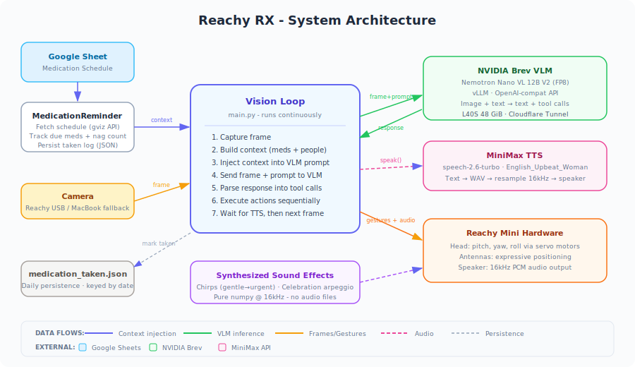
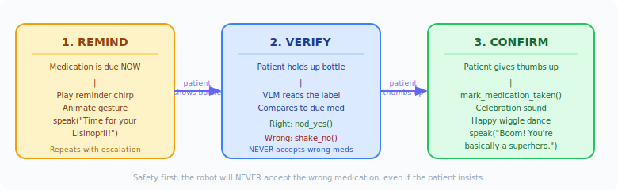

<div align="center">

# Reachy RX

**An embodied AI pharmacist robot that watches, reminds, and cares.**

Built on [Reachy Mini](https://github.com/pollen-robotics/reachy-mini) · Powered by [NVIDIA Nemotron Nano VL](https://huggingface.co/nvidia/NVIDIA-Nemotron-Nano-12B-v2-VL-FP8) · Voice by [MiniMax TTS](https://www.minimaxi.com/)



</div>

---

Reachy RX is an embodied AI pharmacist that helps elderly patients take the right medications on time. It uses a camera to watch for people and medication bottles, a vision-language model to understand what it sees, and text-to-speech to talk through the robot's speaker, all while expressing itself with head gestures, antenna wiggles, and synthesized sound effects.

The robot persona is an upbeat, goofy pharmacist, like a cheerful nurse who cracks dad jokes while keeping patients safe.

## Setup

### 1. Install dependencies

```bash
curl -LsSf https://astral.sh/uv/install.sh | sh
uv sync
```

### 2. Configure environment

Copy the example env and fill in your keys:

```bash
cp .env.example .env
```

```bash
# Required for speech
MINIMAX_TTS_KEY=your_api_key_here
MINIMAX_TTS_GROUP_ID=your_group_id_here

# Only needed for the standalone voice agent (optional)
AGORA_APP_ID=your_app_id_here
AGORA_RESTFUL_KEY=your_restful_key_here
AGORA_RESTFUL_SECRET=your_restful_secret_here
```

### 3. Start the Reachy Mini Daemon

The daemon is a background server that handles low-level communication with motors and sensors. It must be running before you launch the app.

**With robot (USB):**
```bash
uv run reachy-mini-daemon
```

**Simulation (no robot needed):**
```bash
uv run reachy-mini-daemon --sim
```

> **Note:** Keep the daemon terminal open. It must stay running while the app is active.

### 4. Run the app

In a **new terminal**:
```bash
uv run main.py          # normal mode
uv run main.py --debug  # save frames + verbose logging

# custom model/server
uv run main.py --model my-model --server http://host:8000/v1

# custom medication schedule
uv run main.py --sheet-url "https://docs.google.com/spreadsheets/d/..."
```

### VLM Backend

The vision-language model is **[NVIDIA Nemotron Nano VL 12B V2 (FP8)](https://huggingface.co/nvidia/NVIDIA-Nemotron-Nano-12B-v2-VL-FP8)**, running on an NVIDIA L40S GPU (48 GiB) hosted on [Brev](https://brev.dev/) and accessed via an OpenAI-compatible API through a Cloudflare tunnel.

- **Model**: `nemotron-nano-12b-vl`, a 13B parameter vision-language model with C-RADIOv2 vision encoder
- **Quantization**: FP8 for fast inference on NVIDIA GPUs
- **GPU**: NVIDIA L40S (48 GiB) hosted on [Brev](https://brev.dev/)
- **Capabilities**: Image understanding, OCR, visual Q&A, tool/function calling
- **Serving**: vLLM with OpenAI-compatible API endpoints

Override the defaults with `--model` and `--server` flags.

Pass `--lmstudio` to use the LM Studio client (default), which works around tool call parsing issues by describing tools in the system prompt and extracting calls from the model's text output via regex. Use `--no-lmstudio` for servers with native structured tool call support (vLLM, Ollama, OpenAI).

### Text-to-Speech

Speech is handled by **[MiniMax T2A v2](https://www.minimaxi.com/)**, a cloud TTS API that produces natural-sounding speech.

- **Model**: `speech-2.6-turbo`
- **Voice**: `English_Upbeat_Woman`, matches the robot's cheerful persona
- **Flow**: Text → MiniMax HTTP API → hex-encoded WAV → decode → resample to 16kHz → push PCM to Reachy's speaker
- **Behavior**: Non-blocking (daemon thread), drops requests if already speaking

Requires `MINIMAX_TTS_KEY` and `MINIMAX_TTS_GROUP_ID` in your `.env` file.

---

## Architecture Deep Dive

### What is Reachy RX?

Reachy RX turns a [Reachy Mini](https://github.com/pollen-robotics/reachy-mini) desktop robot into an **autonomous medication reminder assistant**. It's designed for elderly patients who may forget to take their pills on time, a real problem that leads to [over 100,000 preventable deaths per year](https://www.ncbi.nlm.nih.gov/pmc/articles/PMC3934668/) in the US alone.

Instead of a phone alarm that's easy to ignore, Reachy RX is a physical presence that:

- **Watches** for the patient through a camera
- **Knows** the medication schedule (pulled live from a Google Sheet)
- **Reminds** with escalating urgency, gentle chirps at first, alarm beeps if ignored
- **Verifies** the patient is taking the *right* medication by reading bottle labels
- **Confirms** with a thumbs-up gesture check before marking meds as taken
- **Celebrates** when medications are taken, happy wiggles and all

### Why Build This?

Medication non-adherence is one of the biggest problems in elder care. Existing solutions (phone alarms, pill organizers, smart dispensers) are either too easy to ignore or too expensive and complex. A robot with a face, a voice, and a personality is much harder to dismiss, and the dad jokes don't hurt either.

The key insight: **a medication reminder needs to be persistent AND likeable**. Reachy RX escalates from a gentle chirp to an urgent alarm, but always with a warm personality. It's the difference between a nagging phone notification and a friendly nurse who genuinely cares.

### How the Vision Loop Works

The core of Reachy RX is a **sequential vision loop** in `main.py`, running on a **NVIDIA Jetson Nano Super**. It runs one iteration at a time, no overlapping frames, no parallel audio, to keep things simple and prevent garbled speech.

Here's what happens on every cycle:

```
┌─────────────────────────────────────────────────────┐
│                    VISION LOOP                      │
│                                                     │
│  ┌──────────┐    Is this a new person?              │
│  │ Grab  │    Any medications due right now?     │
│  │  Frame   │──▶ What meds were already taken?      │
│  └──────────┘    Build a context string from all    │
│       │          of this and inject it.             │
│       ▼                                             │
│  ┌──────────────────────────┐                       │
│  │ Send to VLM          │                       │
│  │                          │                       │
│  │  System prompt (persona) │                       │
│  │  + injected context      │                       │
│  │  + camera frame          │                       │
│  │  + action history        │                       │
│  └──────────────────────────┘                       │
│       │                                             │
│       ▼                                             │
│  ┌──────────────────────────┐                       │
│  │ Parse Response        │                       │
│  │                          │                       │
│  │  Text (internal thought) │                       │
│  │  + Tool calls (actions)  │                       │
│  └──────────────────────────┘                       │
│       │                                             │
│       ▼                                             │
│  ┌──────────────────────────┐                       │
│  │ Execute Actions       │                       │
│  │                          │                       │
│  │  nod_yes / shake_no      │                       │
│  │  look_at(direction)      │                       │
│  │  speak(message) → TTS    │                       │
│  │  remind_medication(name) │                       │
│  │  mark_medication_taken() │                       │
│  └──────────────────────────┘                       │
│       │                                             │
│       ▼                                             │
│  Wait for TTS to finish (up to 20s)             │
│       │                                             │
│       ▼                                             │
│  Track person presence state → next frame        │
└─────────────────────────────────────────────────────┘
```

**Why sequential?** Overlapping frames while audio is playing leads to the VLM seeing a "speaking robot" state and generating contradictory actions. Running one complete cycle at a time keeps behavior predictable.

### Where the Schedule Comes From

The medication schedule lives in a **Google Sheet**, just a shared spreadsheet that a caregiver or pharmacist can edit from anywhere. No database, no custom backend.

| Medication | Dosage | Form | Frequency | Times | Instructions | Condition |
|---|---|---|---|---|---|---|
| Lisinopril | 10mg | Tablet | Once daily | 08:00 | Take with water | Hypertension |
| Omeprazole | 20mg | Capsule | Once daily | 07:30 | Before breakfast | Acid reflux |
| Metformin | 500mg | Tablet | Twice daily | 08:00,18:00 | Take with food | Diabetes |

The system reads this via Google's `gviz` JSON endpoint, a lightweight way to pull structured data from Sheets without a full API integration.

**How reminders work:**

1. **Every loop cycle**, `MedicationReminder.check_and_remind()` checks the schedule
2. Medications within a **±15 minute window** of their scheduled time are flagged as "due"
3. Each due med gets a **nag count** that increments every cycle
4. The nag count drives **escalating urgency** (see below)
5. When the patient gives a thumbs up, `mark_medication_taken()` persists it to `medication_taken.json`
6. Once marked taken, that med stops generating reminders for the rest of the day
7. Schedule is **cached for 30 seconds** to avoid hammering Google's servers

### Escalating Reminders

Reachy doesn't just remind once and give up. It gets increasingly animated:

| Level | Nag Count | Sound | Gesture | Mood |
|:---:|:---:|---|---|---|
| 🟢 | 1 | Gentle chirp ↗ | Soft head tilt + curious antenna perk | "Hey, just a reminder..." |
| 🟡 | 2 | Double chirp ↗↗ | Bouncy side-to-side wiggle | "C'mon, time for your meds!" |
| 🟠 | 3 | Triple chirp ↗↗↗ | Wiggles + antenna flapping + look-up plea | "Please? Pretty please?" |
| 🔴 | 4+ | Alarm beeps | Rapid wiggles → sad droop → hopeful perk-up | "I'm REALLY worried now!" |

All sounds are **synthesized with numpy** at runtime, no audio files. Pure math generating chirps, arpeggios, and alarm tones at 16kHz.

### The Robot's Actions (Tool System)

The VLM controls Reachy through **6 tool calls** defined as OpenAI-format function schemas:

| Tool | What It Does | Physical Effect |
|---|---|---|
| `nod_yes()` | Confirm / say yes | Head pitch up/down ×2 |
| `shake_no()` | Deny / signal concern | Head yaw left/right ×2 |
| `look_at(direction)` | Track patient position | Head turns to left/right/up/down/center |
| `speak(message)` | **Talk to the patient** (only audible output) | MiniMax TTS → WAV → Reachy speaker |
| `remind_medication(name)` | Play reminder chirp + gesture | Escalating animation based on nag count |
| `mark_medication_taken(name, due_time)` | Record med as taken | Celebration sound + happy wiggle dance |

> **Important:** `speak()` is the **only** way the patient hears the robot. Everything else the VLM outputs is internal thinking. If the model doesn't call `speak()`, the patient hears nothing.

### The Core Flow: Remind → Verify → Confirm



### Person Presence Detection

The vision loop tracks whether someone is in front of the camera using a simple **keyword-based state machine**, no separate face detection model needed.

After each VLM response, the text output is scanned for keywords:

- **Person present**: "person", "someone", "patient", "face", "thumbs", "holding", etc.
- **No one present**: "no one", "nobody", "empty", "alone", "waiting"

State transitions:
- **No one → Person detected**: Inject "🆕 NEW PERSON" context, VLM greets once
- **Person present**: Inject "👤 PATIENT PRESENT" context, no re-greeting
- **Person → No one**: Reset greeting state, ready for next visitor

### VLM Client Architecture

The VLM integration uses an **abstract base class** pattern so backends are swappable:

```
BaseVLMClient (ABC)
├── LMStudioVLMClient  - Tools described in system prompt, parsed from text via regex
└── OpenAIVLMClient    - Native structured tool calls via tools= API parameter
```

**Why two clients?** LM Studio's tool call parser silently drops tool calls for certain models (including Nemotron VL). The LM Studio client works around this by embedding tool descriptions in the system prompt and using regex to extract calls like `nod_yes()` or `speak({"message": "Hello!"})` from the model's text output.

The OpenAI client works with any server that properly implements the OpenAI tools API (vLLM, Ollama, OpenAI itself).

Both clients share:
- **Frame encoding**: JPEG → base64 data URI (85% quality)
- **Rolling history**: Last 100 action/observation entries to prevent repetition
- **Context injection**: `inject_context()` prepends situational info to the next prompt
- **Async support**: `step_async()` / `step_collect()` for overlapping network latency with action execution

### File Map

| File | Purpose |
|---|---|
| `main.py` | Entry point, vision loop, camera init, Reachy connection, context injection, person state machine |
| `vlm_client.py` | Base client + tool definitions (6 tools) + `execute_tool_calls()` gesture choreography |
| `vlm_client_lmstudio.py` | LM Studio backend, regex-based text tool call parsing |
| `vlm_client_openai.py` | Standard OpenAI-compatible backend |
| `medication_reminder.py` | Google Sheets schedule fetcher, due-med checker, taken-log persistence |
| `minimax_tts.py` | Direct MiniMax HTTP TTS → Reachy speaker, non-blocking daemon thread |
| `sounds.py` | Synthesized sound effects (chirps, celebration), pure numpy, no audio files |
| `macbook_camera.py` | MacBook FaceTime camera fallback for development |
| `system_prompt.md` | Robot persona, behavior rules, action examples |
| `medication_taken.json` | Daily log of medications taken (auto-generated, gitignored) |

### Tech Stack

| Component | Technology |
|---|---|
| **Robot** | [Reachy Mini](https://github.com/pollen-robotics/reachy-mini), desktop robot with head servos, antennas, speaker |
| **Edge Compute** | NVIDIA Jetson Nano Super, runs the vision loop and all local processing |
| **VLM** | [NVIDIA Nemotron Nano VL 12B V2 FP8](https://huggingface.co/nvidia/NVIDIA-Nemotron-Nano-12B-v2-VL-FP8), 13B param vision-language model on NVIDIA L40S (48 GiB) via [Brev](https://brev.dev/) |
| **TTS** | [MiniMax T2A v2](https://www.minimaxi.com/), `speech-2.6-turbo` model, `English_Upbeat_Woman` voice |
| **Schedule** | Google Sheets via gviz JSON API |
| **Language** | Python 3.11–3.12, managed with [uv](https://docs.astral.sh/uv/) |
| **Vision** | OpenCV (BGR → JPEG → base64) |
| **Audio** | numpy-synthesized sounds at 16kHz, pushed via Reachy's PCM speaker API |
| **Serving** | vLLM on NVIDIA L40S (48 GiB) via [Brev](https://brev.dev/), exposed through Cloudflare tunnel |
